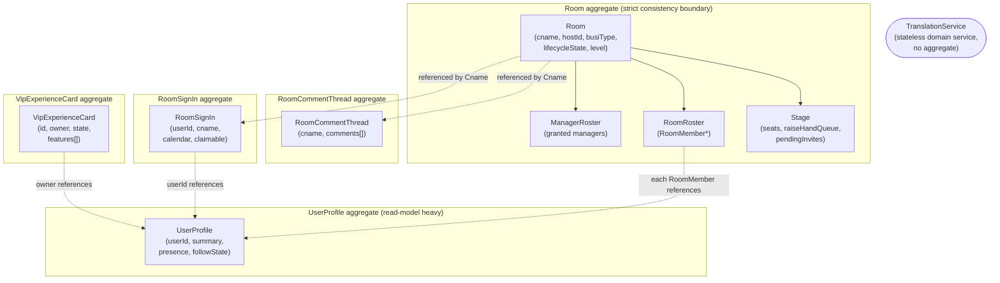

# Aggregate Diagram

Five aggregate roots in one bounded context. Solid boxes = same-transaction consistency boundary (child entities). Dashed arrows = reference-by-id only (eventual consistency across aggregates is fine, and expected).

## Reading this diagram

- **`Room` is the only aggregate with child entities in the strict DDD sense** — `Stage`, `RoomRoster`, `ManagerRoster` cannot be loaded, mutated, or persisted independently of their parent `Room`. Any command touching them goes through `Room`'s own methods (`Room.assignStageSeat(...)`, not `Stage.assignSeat(...)` called directly from the application layer).
- **All other aggregates reference `Room` only by `Cname`** (a value, not an object reference) — this is deliberate. `RoomCommentThread` doesn't hold a `Room` field; it holds a `Cname`. This means posting a comment never needs to load the (potentially large) `Room` aggregate at all — a real performance property, not just an academic DDD purity point, since `Room` aggregates in this system can have large `RoomRoster` collections for a busy voice room.
- **`UserProfile` is referenced by everything but doesn't reference back** — it's the "leaf" of the graph. This matches its role: read-heavy reference data, not a coordinator.
- **`TranslationService` has no aggregate at all** — shown outside every subgraph because it participates in no aggregate boundary; it's a pure stateless operation.
