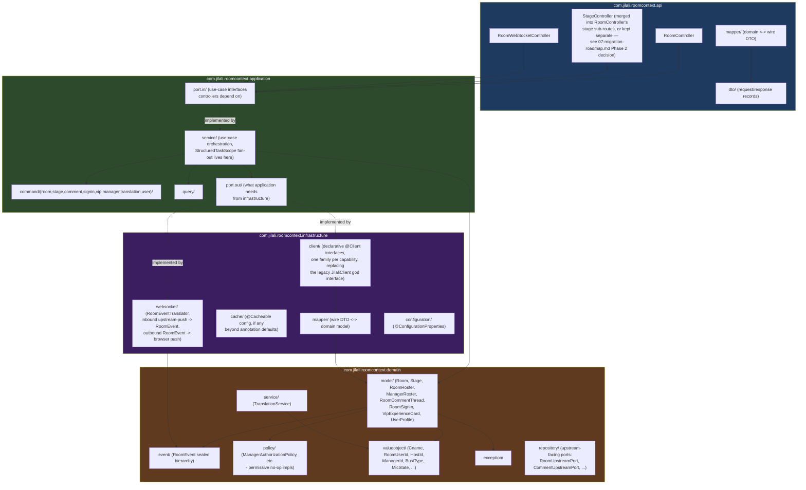

# Package Dependency Diagram — New Structure

## Dependency rules enforced by this structure

1. **`domain` imports nothing from `api`, `application`, or `infrastructure`.** It is the only package with zero outward dependency on the rest of this bounded context — pure Java 25 + JDK only (plus `io.micronaut.serde.annotation.Serdeable` on value objects that cross the wire boundary directly, which is a pragmatic exception discussed in `06-package-dependency-analysis.md`).
2. **`application` imports `domain` (allowed — it orchestrates domain objects) and its own `port.out` interfaces (allowed — but never a concrete `infrastructure` class).** This is what makes the application layer testable without any real HTTP calls: `port.out` interfaces get fake/stub implementations in tests.
3. **`infrastructure` imports `domain` and `application.port.out`** (to implement the ports) but is never imported BY `domain` or `application`. This is the Dependency Inversion Principle made structural: infrastructure depends on the abstraction, not the reverse.
4. **`api` imports `application.port.in`** (the use-case interfaces) — never `domain` directly, and never `infrastructure` at all. Controllers stay thin because they literally cannot reach into domain internals or upstream-call details even if someone tried.

This is the structural fix for the audit's #1-ranked architectural blocker (`docs/audit/reports/dependency-analysis.md`): the legacy `com.jilali.client` package imports feature DTOs AND is imported BY feature packages, a true cycle. In the new structure, **nothing points backward** — `infrastructure.client` depends on `domain.model` (downward), never the other way. There is no package here that both feature code depends on AND that depends back on feature code.
