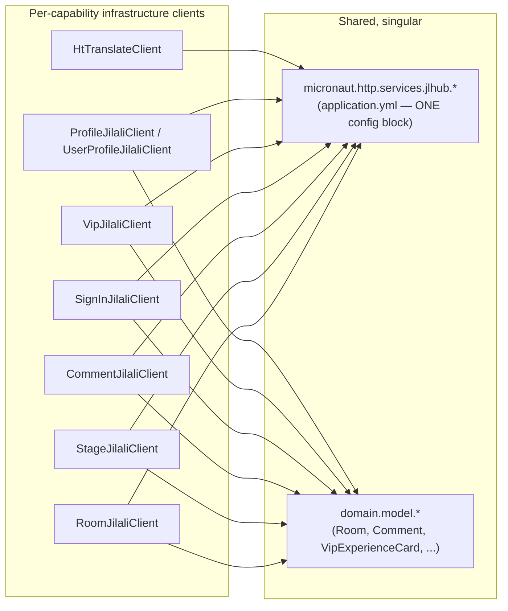

# Package Dependency Analysis — New Structure vs Legacy

## The legacy cycle, restated

Per `docs/audit/reports/dependency-analysis.md` (re-verified during the prior refactor pass): `com.jilali.client` imports DTOs from 7 feature packages (`comment.dto`, `manager.dto`, `room.dto`, `signin.dto`, `stage.dto`, `user.dto`, `vip.dto`) as `@Client` method signatures, while every one of those packages imports `com.jilali.client.*` back to actually invoke the HTTP calls. A true cycle.

That same audit pass also recorded a deliberate **scope decision to defer** fixing this in the legacy codebase (`docs/audit/reports/roadmap.md`, Phase 2 status note) — the blast radius (7 injection sites, two of which drive delicate `StructuredTaskScope` parallel fan-out) made a live, in-place split too risky to attempt as a drive-by change to running code.

**This document is not that same undertaking.** Building a **new** module from scratch sidesteps the risk entirely — there is no running code to break, because nothing here executes until Phase 3 of the migration roadmap begins wiring real endpoints. The cycle is avoided by construction, not fixed under pressure.

## How the new structure avoids the cycle by construction

The legacy cycle exists because ONE package (`client`) tried to be both "the thing every feature calls" AND "the thing whose method signatures are typed in terms of every feature's own DTOs." The new structure never lets a single package hold both responsibilities:

```
com.jilali.roomcontext.domain.model          <- owns the canonical types (Room, Comment, VipExperienceCard, ...)
com.jilali.roomcontext.application.port.out  <- interfaces typed in terms of domain.model (not feature-specific DTOs)
com.jilali.roomcontext.infrastructure.client  <- implements port.out; translates HelloTalk wire DTOs to domain.model
```

`infrastructure.client.RoomJilaliClient` (the new home for room-related upstream calls) depends on `domain.model` (downward, always allowed) and on `infrastructure.mapper` (also downward). It is never imported BY `domain` or `application` — those only ever import the `port.out` *interface*, never the concrete `infrastructure.client` class. There is no package anywhere in this graph that is both depended-upon-by-features and dependent-upon-features simultaneously, which is precisely the condition that produced the legacy cycle.

## Why splitting `@Client` interfaces doesn't duplicate configuration

The legacy `JilaliClient`'s own Javadoc argues against per-feature splitting: *"A BFF talks to a single upstream with one base URL and one auth scheme, so splitting this per feature would just duplicate configuration."* This is correct as far as it goes, but conflates two different things: **HTTP client configuration** (base URL, auth scheme, connection pool — genuinely one thing) and **Java interface declaration** (which methods live on which type — genuinely can be many things without touching the first).

Micronaut's `@Client(id = "...")` keys the underlying `HttpClient`/connection pool by `id`, not by interface. Multiple `@Client` interfaces can share the exact same `id`:

```java
@Client(id = "jlhub", path = "/livehub")
public interface RoomJilaliClient { /* room methods only */ }

@Client(id = "jlhub", path = "/livehub")
public interface StageJilaliClient { /* stage methods only */ }
```

Both compile to independent generated implementations, but Micronaut resolves `id = "jlhub"` to the SAME configured `HttpClientConfiguration` bean (same base URL, same TLS/auth setup, same connection pool) — there is exactly one place that configuration lives (`application.yml`'s `micronaut.http.services.jlhub.*` block, unchanged from legacy), regardless of how many `@Client` interfaces reference it. Splitting the interface duplicates a few characters of annotation value (`id = "jlhub", path = "/livehub"` repeated per interface) — it does not duplicate configuration in the sense the legacy Javadoc was worried about (URL, auth headers, pool sizing all stay singular).

## New package graph



No arrows point from `Shared` back to `Feature-facing` — the acyclic property is structural, not a discipline that has to be maintained by convention (which is exactly how the legacy cycle crept in over time: nothing enforced it, so it drifted).

## What lives where, concretely

| New package | Legacy equivalent(s) | Notes |
|---|---|---|
| `roomcontext.domain.model` | Scattered across `room.dto`, `stage.dto`, `comment.dto`, `signin.dto`, `vip.dto`, `user.dto` (the ~90 combined DTO files) | Collapses to the 5 aggregates + their value objects — see `08-class-mapping.md` for the full file-level table. |
| `roomcontext.infrastructure.client` | `client.JilaliClient` (god interface), `client.ProfileClient`, `client.VipExperienceCardClient` if it exists | One interface per capability instead of one god interface. |
| `roomcontext.infrastructure.mapper` | Ad-hoc inline mapping currently scattered in controllers/services (e.g. `CommentController`'s deleted `toDto`/`toMsgDto` methods, `RoomJoinService`'s equivalents) | Centralizes wire-DTO ↔ domain-model translation that today is duplicated per-caller. |
| `roomcontext.application.port.out` | (didn't exist — this is new) | The seam that makes `application` testable without HTTP. |
| `roomcontext.infrastructure.websocket` | `im.ImEventSource`/`realtime.RoomEventSource` (the `Sinks.Many` pub-sub) | Becomes `ApplicationEventPublisher`-based (see `00-architecture-overview.md`). |

## Verifying the no-cycle property once code exists

Per the goal's own migration strategy, "verify no cycle remains" belongs to an acceptance check, not just a design promise. Once Phase 3 implementation begins, add a structural test (e.g. via `ArchUnit` — not currently a project dependency, would need adding — or a simpler `jdeps`-based Gradle check) asserting: no class under `roomcontext.domain` or `roomcontext.application` may import anything under `roomcontext.infrastructure`. This is cheap to write once and prevents the exact kind of silent architectural drift that produced the legacy cycle in the first place.
